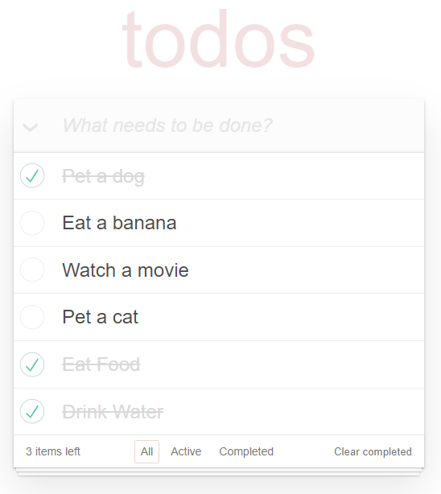

# Todo App with API

## About
Todo app with CRUD operations. Also you can sort, check all and clear all completed tasks.

Here is [the working example](https://twoandmore.github.io/Todo-App-with-API/).

### Todo form
!

## How to work with
1. Download or clone repository. `git clone https://github.com/TwoAndMore/Todo-App-with-API.git`.
2. Open project folder with code editor (VS Code, WebStorm, other).
3. Run ```npm install``` in terminal.
4. Open second terminal and run ```npm start```.
5. If tab does not open, go to ```http://localhost:3000``` in your browser.

